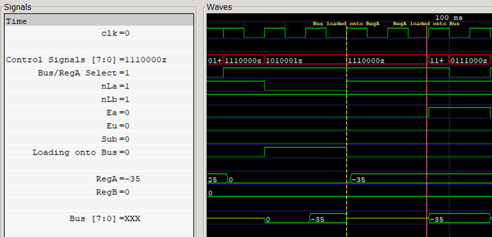
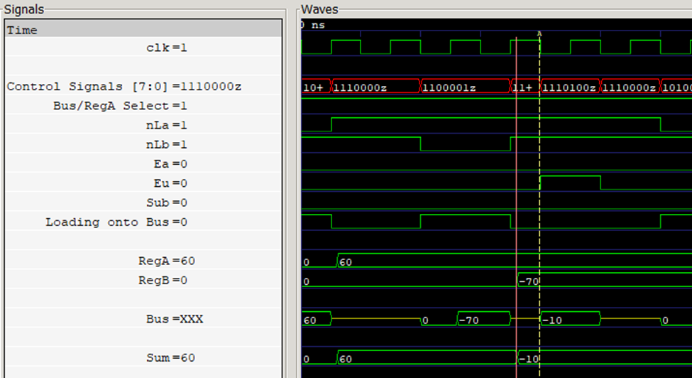
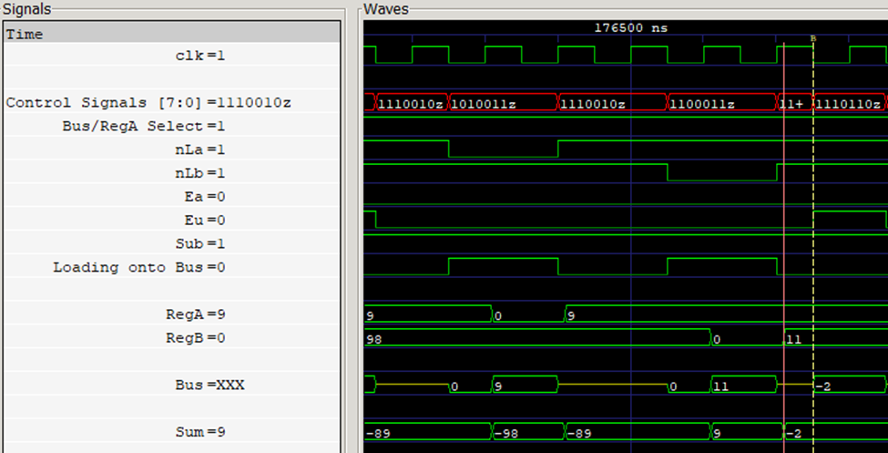
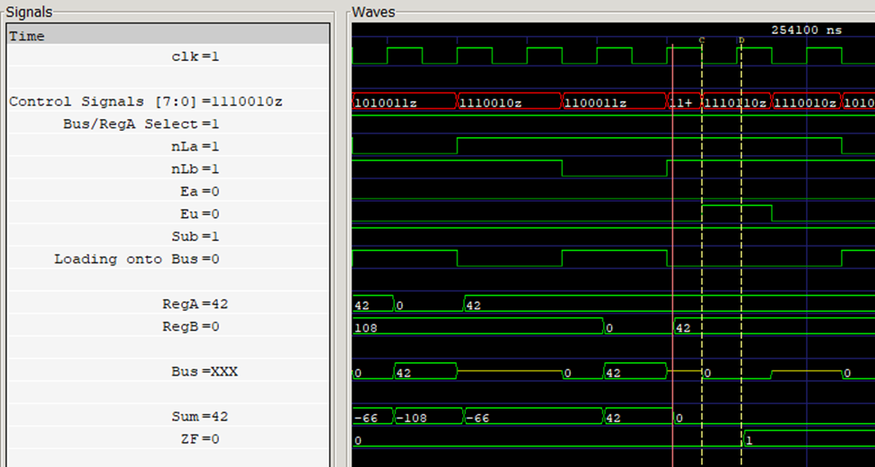

<!---

This file is used to generate your project datasheet. Please fill in the information below and delete any unused
sections.

You can also include images in this folder and reference them in the markdown. Each image must be less than
512 kb in size, and the combined size of all images must be less than 1 MB.
-->

## How it works

This repository contains the circuit for a basic 8-bit ripple adder and its complementary accumulator register. The adder assumes 2s complement inputs and thus supports addition and subtraction. It pushes the result to the bus via tri-state buffer. It also includes a zero flag to support conditional operation as well as a carry flag. These flags are synchronized to the rising edge of the clock and are updated when the adder outputs to the bus. 

The accumulator register functions to store the output of the adder. It is synchronized to the positive edge of the clock. The accumulator loads and outputs its value from the bus and is connected via tri-state buffer. The accumulator’s current value is always available as an ouput (and usually connected to the Register A input of the ALU)
These two modules work in tandem and are a part of a larger project which includes peripheral and control blocks to ultimately create a functioning, basic, 8-bit CPU. 

## IO Table: Accumulator (A) Register

| **Name**      | **Verilog**      | **Description**      | **I/O**          | **Width (bits)** | **Active**       |
| ------------- | ---------------- | -------------------- | ---------------- | ---------------- | ---------------- |
| clk           | clk              | Clock Signal         | Input            | 1                | Rising edge      |
| bus           | bus              | Connection to bus    | IO               | 8                | NA               |
| load          | nLa              | Load from Bus        | Input            | 1                | 0                |
| enable_out    | Ea               | Output to Bus        | Input            | 1                | 1                |
| Register A    | regA             | Accumulator Register | Output           | 8                | NA               |
| reset         | rst_n            | Reset Signal         | Input            | 1                | 0                |

## IO Table: ALU (Adder/Subtractor)

| **Name**      | **Verilog**      | **Description**      | **I/O**          | **Width (bits)** | **Active**       |
| ------------- | ---------------- | -------------------- | ---------------- | ---------------- | ---------------- |
| clk           | clk              | Clock Signal         | Input            | 1                | Rising edge      |
| enable_out    | Eu               | Output to Bus        | Input            | 1                | 1                |
| Register A    | reg_a            | Accumulator Register | Input            | 8                | NA               |
| Register B    | reg_b            | Register B           | Input            | 8                | NA               |
| subtract      | sub              | Perform Subtraction  | Input            | 1                | 1                |
| bus           | bus              | Connection to bus    | Output           | 8                | NA               |
| Carry Out     | CF               | Carry-out flag       | Output           | 1                | 1                |
| Result Zero   | ZF               | Zero flag            | Output           | 1                | 1                |

## Tests and Expected Functionality

The waveform in Figure 1 shows the loading and output functionality of the accumulator (RegA). The yellow marker displays the load functionality of the accumulator: On the rising edge of the clock, when nLa is low, the value from the bus is loaded onto the RegA.  
The red marker displays the output functionality of the accumulator: On the rising edge of the clock, when Ea becomes high, the value from the accumulator is pushed onto the bus. 

The waveform in Figure 2 demonstrates basic addition done by the adder. Note that at the red marker, Sub is low, thus addition is being performed. The addition is done asynchronously, and the value of Sum goes from 60 (60 + 0) to -10 (60 + -70). At the yellow marker, Ea is high, and thus the result of the addition is pushed onto the bus. Note that the Sum signal is internal.  

Similarly, the waveform in Figure 3 demonstrates basic subtraction by the adder. Note that at the red marker, Sub is high, thus subtraction is being performed. In this case, the rest 9-11 is calculated asynchronously resulting in -2. At the yellow marker, when Eu is set high, the result is pushed onto the bus. 

The waveform in Figure 4 demonstrates the functionality of ZF (zero flag). As described above, at the red marker, the subtraction 42-42 is performed, resulting in 0. The result is the pushed to the bus when Ea is set high. At the rising edge of the clock, when Ea remains high, ZF is also made high, indicating that the result of the operation (in this case, subtraction), was zero.  

## Description of Testbenches

These modules have been tested under six Testbenches. For the purposes of the tests, all random numbers are between 0 and 255. The tests are briefly detailed below: 

### Adder Tests:

#### adder_test_addition_range:
This test computes the addition of 50 random pairs of numbers and checks to see if the addition was correct. 

#### adder_test_subtraction_range:
This test computes the subtraction of 50 random pairs of numbers and checks to see if the subtraction was correct.

#### adder_test_addsub_range:
This test computes either addition or subtraction (randomly determined before each operation) of 50 random pairs of numbers and checks to see if the result is correct.

### Accumulator Tests:
#### accumulator_test_randint:
This test loads a random number from the bus onto the accumulator, and checks whether the values on the bus and in the accumulator match. 

#### accumulator_test_randint_out:
This test loads a random number from the bus onto the accumulator and checks whether the values on the bus and in the accumulator match. It then outputs the value of the accumulator onto the bus and checks whether the values on the bus and in the accumulator match as expected. 

#### accumulator_test_shuffled_range:
This test performs the accumulator_test_randint_out test consequently with 25 randomly chosen non-repeating values 

